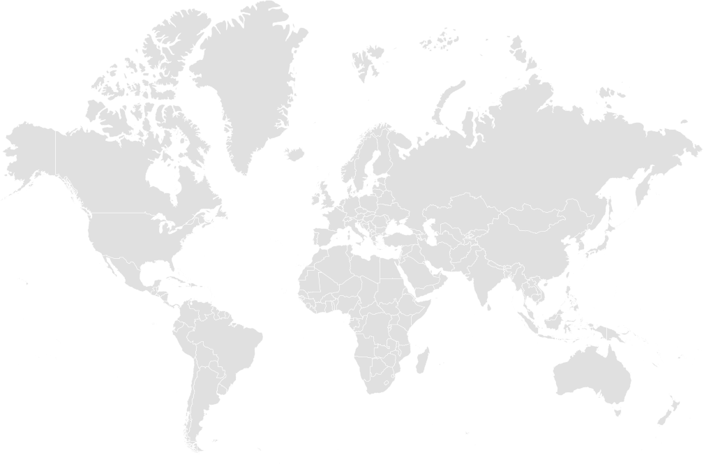

# SVG 世界地图 - 深浅模式版本

本文件夹包含两张适用于深色和浅色模式的 SVG 世界地图。

## 文件说明

### 1. world-light.svg（浅色模式）
- **用途**：适用于浅色背景的网站或应用
- **配色方案**：
  - 地图填充色：`#e0e0e0`（浅灰色）
  - 边框颜色：`#ffffff`（白色）
  - 悬停颜色：`#4a90e2`（蓝色）
- **文件大小**：约 1.2 MB
- **特性**：包含世界所有国家和地区，带有 ISO 国家代码

### 2. world-dark.svg（深色模式）
- **用途**：适用于深色背景的网站或应用
- **配色方案**：
  - 地图填充色：`#2d3748`（深灰蓝色）
  - 边框颜色：`#1a202c`（深色）
  - 悬停颜色：`#4a90e2`（蓝色）
- **文件大小**：约 1.2 MB
- **特性**：包含世界所有国家和地区，带有 ISO 国家代码

## 使用方法

### HTML 中直接引用
```html
<!-- 浅色模式 -->


<!-- 深色模式 -->

```

### CSS 响应式切换
```css
/* 浅色模式 */
@media (prefers-color-scheme: light) {
  .world-map {
    background-image: url('world-light.svg');
  }
}

/* 深色模式 */
@media (prefers-color-scheme: dark) {
  .world-map {
    background-image: url('world-dark.svg');
  }
}
```

### React 示例
```jsx
import { useEffect, useState } from 'react';

function WorldMap() {
  const [theme, setTheme] = useState('light');
  
  useEffect(() => {
    const isDark = window.matchMedia('(prefers-color-scheme: dark)').matches;
    setTheme(isDark ? 'dark' : 'light');
  }, []);
  
  return (
    
  );
}
```

## 地图特性

- **地理投影**：Robinson 投影（罗宾逊投影）
- **国家标识**：每个国家都有唯一的 ISO 2 字母代码
- **交互性**：内置悬停效果，鼠标悬停时国家会变为蓝色
- **可编辑性**：SVG 格式可在 Illustrator、Inkscape 等软件中编辑
- **响应式**：矢量格式，可无损缩放至任意尺寸

## 许可证

这些地图基于 MapSVG 提供的免费世界地图，允许商业和个人使用。

## 技术规格

- **格式**：SVG（可缩放矢量图形）
- **尺寸**：1009.67 × 665.96 像素（原始尺寸）
- **编码**：UTF-8
- **兼容性**：所有现代浏览器

## 自定义配色

如需修改配色方案，可编辑 SVG 文件中的 `<style>` 标签：

```css
<style>
  path {
    fill: #your-color;        /* 地图填充色 */
    stroke: #your-color;      /* 边框颜色 */
    stroke-width: 0.5;        /* 边框宽度 */
  }
  path:hover {
    fill: #your-color;        /* 悬停颜色 */
  }
</style>
```

## 支持

如有问题或需要帮助，请访问 [MapSVG](https://mapsvg.com) 官方网站。
